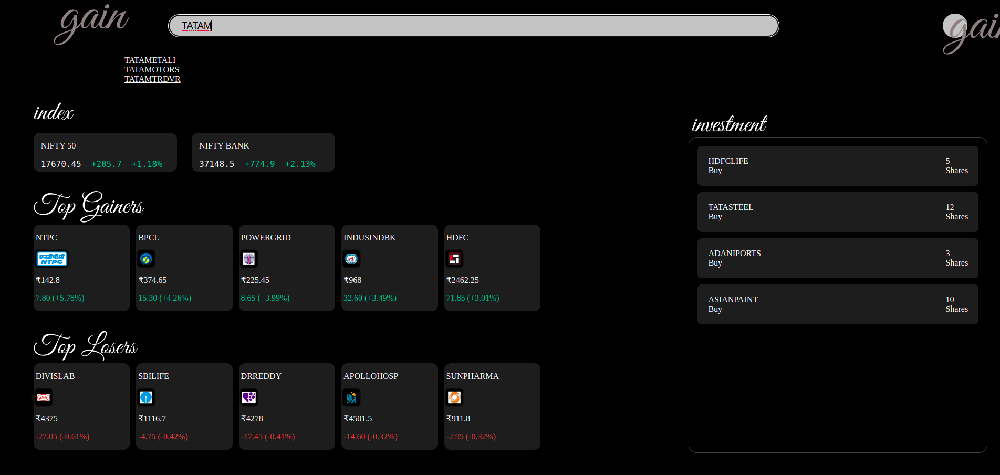
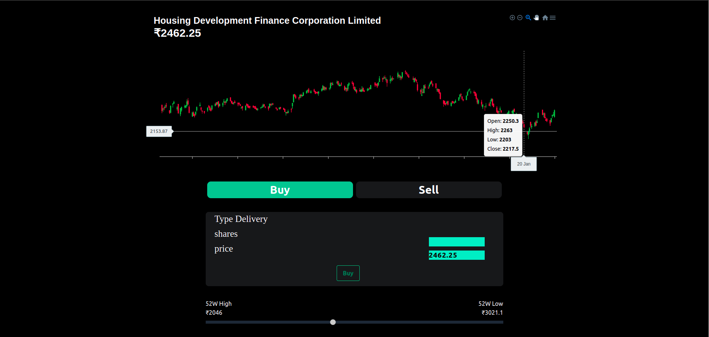
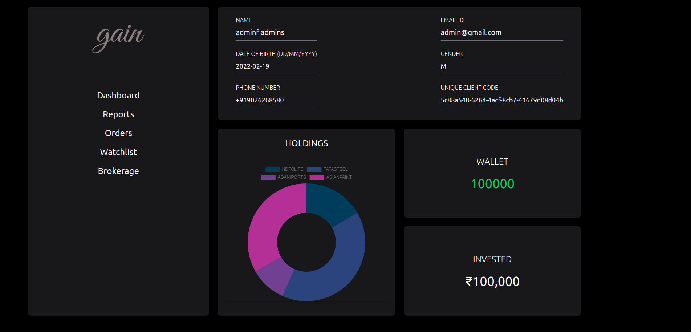
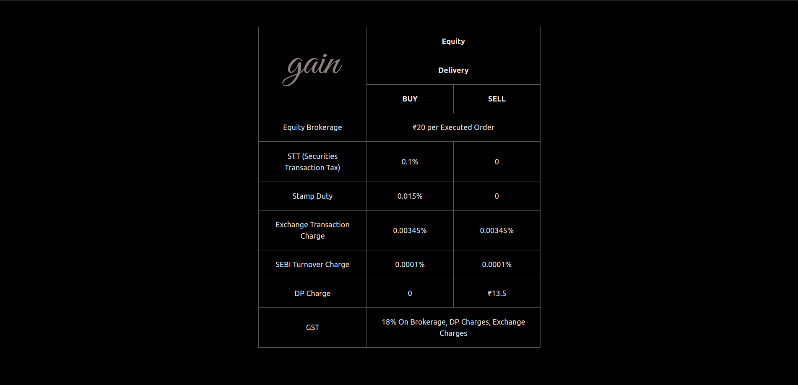
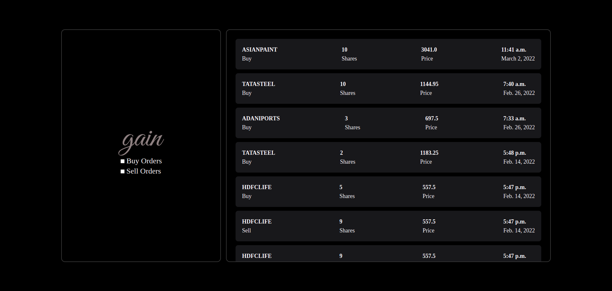

# stock_broker
python3 -> 3.6.9

ongoing...
run 'pipreqs' to create requirements.txt

# Dashboard UI

# Detail UI

# Profile UI

# Brokerage UI

# All Orders UI

# LOGIN UI

# SIGNUP UI

# Detail UI

